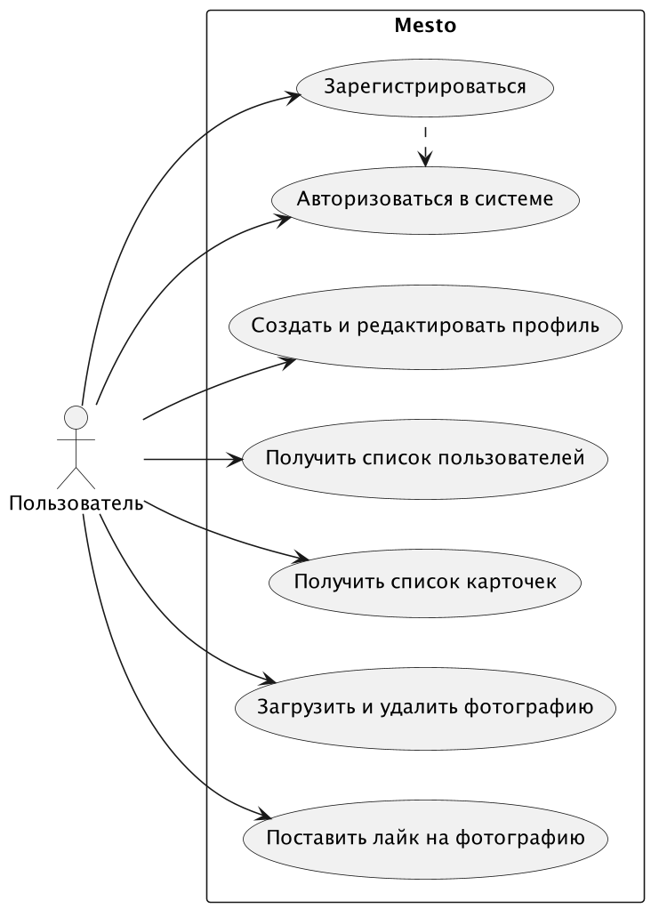
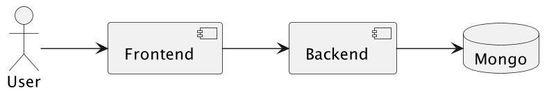
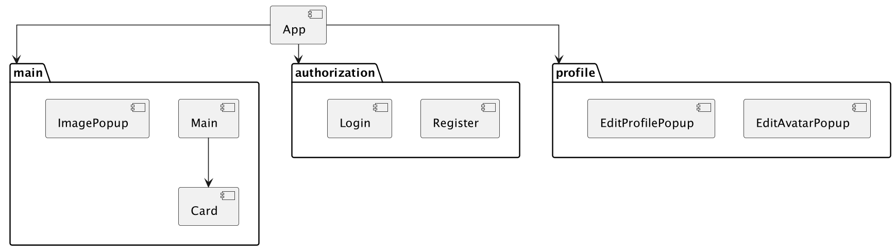
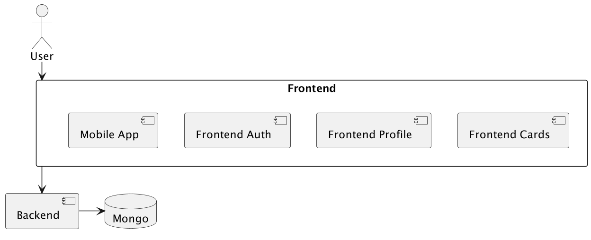

# Mesto

Проект позволяет пользователям делиться фотографиями с другими людьми.

## Описание

### Диаграмма вариантов использования

### Диаграмма потоков данных

В настоящий момент проект состоит из следующих компонентов:

- frontend приложение, написанное на React
- backend сервис, написанный на JavaScript с фреймворком Express
- база данных mongodb

### Диаграмма компонентов:

Приближенно диаграмма компонентов с разделениями по бизнес-функционалу выглядит так:

## Планирование изменений

### Сложность и масштаб проекта

- Предположим, что проект будет активно развиваться (текущий функционал не очень обширен). Вероятно, в скором
  времени бизнес потребует реализации нового функционала. Примеры новых вариантов использования:
    - возможность авторизации через сторонние сервисы
    - развитие функционала по редактированию профиля
    - добавление пользователей в друзья/подписчики
    - возможность загружать видео
    - добавление на публикацию картографических меток и отображение истории публикации на карте
    - ...

- На текущий момент приложение имеет лишь один вариант поставки - web сервис. Приложение по обмену фотографиями также
  может иметь потребность установки на мобильные телефоны.

Когда размер и сложность приложения продолжат расти, актуальность перехода на микрофронтенды возрастет.

#### Допускаем, что:

- ресурсы команды разработки в избытке или не достигли ограничения
- планы развития проекта выстроены далеко вперед
- команда имеет хотя бы базовый опыт или понимание работы микрофронтендов, инфраструктура позволяет развернуть и
  управлять несколькими приложениями фронтенда
- организационная структура компании линейная или матричная с разделением ответственности по развитию разных компонентов
  приложения (или планирует ей быть)

**Вывод:** Принимаем решение о переходе на микрофронтенды

### 1. Разделение на микрофронтенды

#### Некоторые особенности прилжоения:

- в приложении разные компоненты системы должны иметь доступ к общему состоянию (как минимум, currentUser)
- приложение имеет несколько бизнес-возможностей - авторизация пользователя, профиль и личная страница пользователя,
  список карточек с изображениями
- компонент, отвечающий за отображение карточек с изображениями требует повышенного внимания к производительности и
  скорости отклика

Исходя из этого, мы делаем вывод в пользу использования стратегий вертикальной нарезки и автономности команд:
Используя эти стратегии предлагаем разделить монолитный фронтенд на следующие компоненты:

- Микрофронтенд страницы авторизации
- Микрофронтенд профиля пользователя
- Микрофронтенд панели карточек с контентом

Также учитываем, что для разработки мобильного приложения будет создан отдельный компонент

Новая диаграмма потоков данных (компонент бэкенда в задании не рассматриваем):

Стек технологий на текущем стеке останется прежним, поскольку он уже реализован. Новый стек будем рассматривать при
необходимости добавления новых микрофронтендов.

### 2. Инструмент для создания микрофронтендов

В рамках данного проекта мы выбрали Webpack Modules Federation в качестве инструмента создания микрофронтендов по
следующим причинам:

- Module federation не потребует значительно изменять ci проекта в отличии от Single-SPA
- Module federation позволяет использовать разные версии зависимостей для микрофронтендов без конфликтов, что является
  существенным преимуществом при независимой разработке
- Не требует такого количества зависимостей, как вся система Single-SPA

### Модульное взаимодействие

Для модульного взаимодействия будем использовать глобальное состояние на основе библиотеки ReactContext. Такое решение
не потребует существенных доработок.

## Итоговая архитектура

### Модули:

- Регистрации и авторизации
- Профиля пользователя
- Карточек контента

### Компоненты:

- Регистрация и авторизация
    - Login
    - Register
- Профиль пользователя
    - EditAvatarPopup
    - EditProfilePopup
- Карточек контента
    - Main
    - Card
    - AddPlacePopup
    - ImagePopup
- Общие компоненты:
    - PopupWithForm

# Задание 2

https://drive.google.com/file/d/1RG756Yt-VWhEzb3hyjNDaUG2piXva-LR/view?usp=sharing